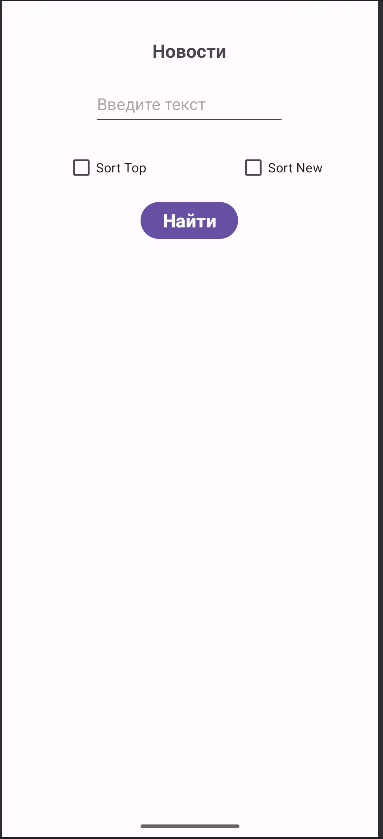
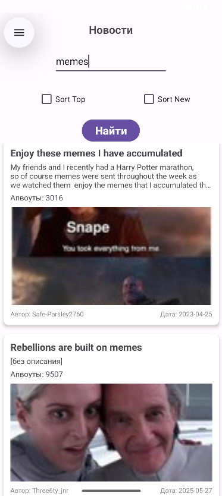
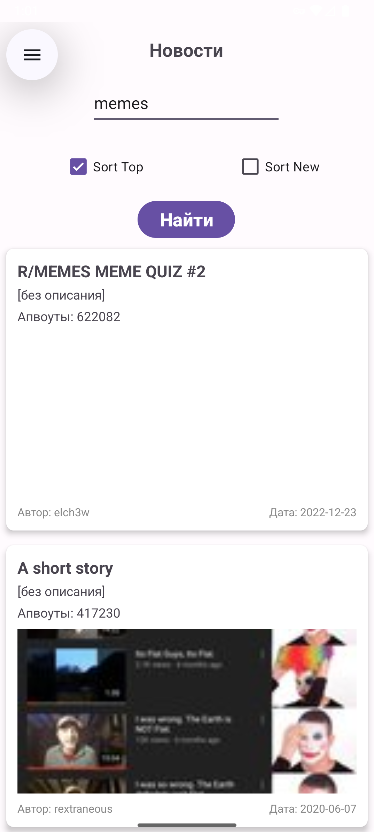
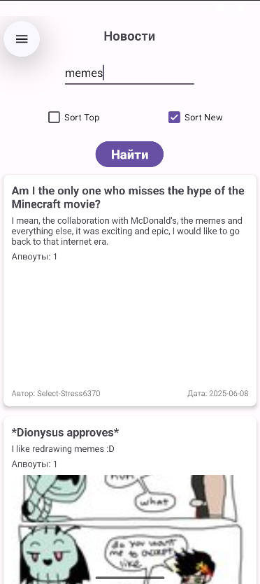

<h1>My First Kotlin Project</h1>

Hi! This my first  kotlin project.

This application derives the Radit posts based on the requested topic.

    
    

There are also two sorting, you can sort it from the newest, or sort in popularity.

    
    

Also when pressing the post, it is open directly in the application without moving into a non -entry browser:point_down:

